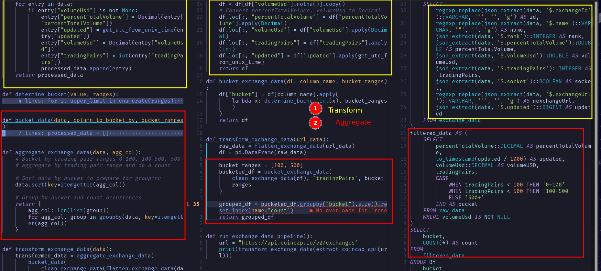

Code for blog at https://www.startdataengineering.com/post/sql-v-python/.

* [SQL v Python for Data Transformation](#sql-v-python-for-data-transformation)
    * [Setup](#setup)
        * [Run on codespaces](#run-on-codespaces)
        * [Running locally](#running-locally)
    * [Code Comparison](#code-comparison)

# SQL v Python for Data Transformation

## Setup

### Run on codespaces

Open this repo in your codespace by clicking on [this link](https://github.com/codespaces/new?skip_quickstart=true&machine=basicLinux32gb&repo=822801955&ref=main&geo=UsEast).

Wait for codespaces to setup environment with the [requirements.txt](./requirements.txt) file.

```bash
# run data transformations with 
python src/native_python.py
python src/dataframe_python.py
duckdb :memory: < ./src/query.sql
```

Your output will be the same. Run linting, tests as:

```bash
make ci
```

### Running locally

**Prerequisite:**

1. Python 3.11+
2. git

Clone the repo, create a virtual env and run the code as shown below:

```bash
git clone https://github.com/josephmachado/python-v-sql-for-data-transform.git
cd python-v-sql-for-data-transform
python -m venv env
source env/bin/activate
pip install -r requirements.txt

# run data transformations with 
python src/native_python.py
python src/dataframe_python.py
duckdb :memory: < ./src/query.sql
```

Your output will be the same. Run linting, tests as:

```bash
make ci
```

## Code Comparison 


